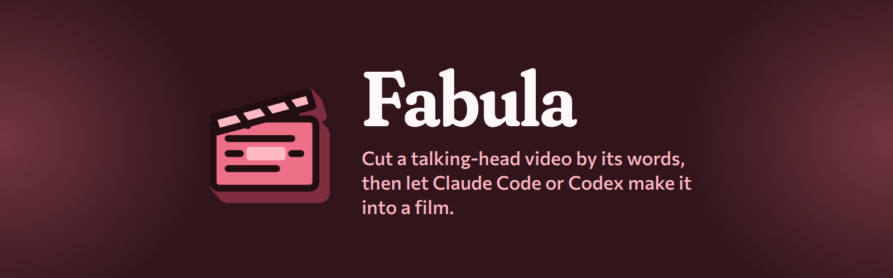
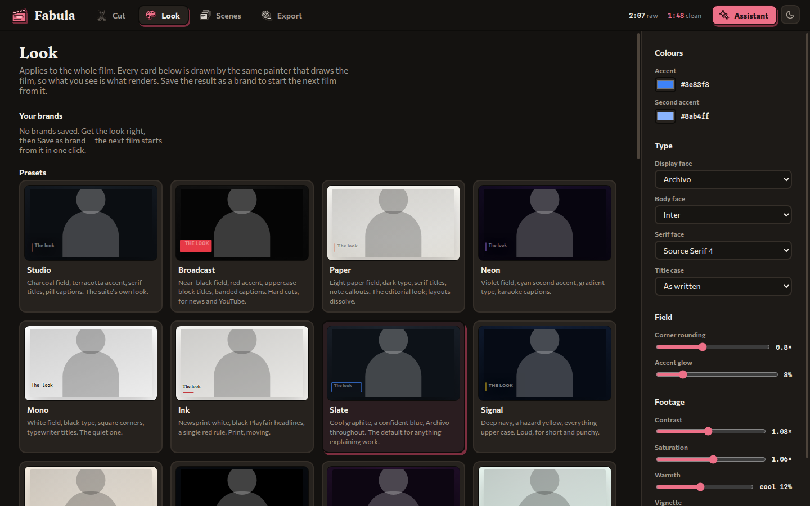
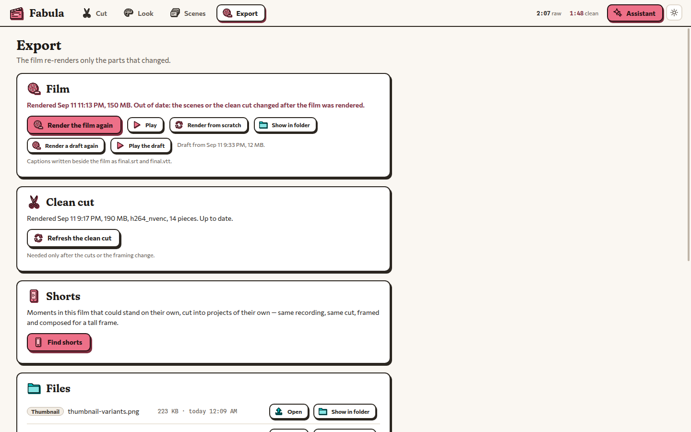

<p align="center"></p>

# Fabula

Cut a talking-head video by its words, then let Claude Code or Codex make it into a film.

Fabula is a local, transcript-driven video editor. It transcribes a recording with WhisperX,
proposes cuts, and shows every cut as struck-through text for you to review before anything
renders. Claude Code or Codex, on your own subscription, then composes the film around the
speaker through Fabula's MCP tools while you watch and adjust in the window. It also makes
motion films: pieces that are only motion graphics, with no recording.

Current version: **0.3.1**.

<p align="center">
  
  
</p>

## What it does

**Projects.** A project points at a recording where it lives (nothing is copied) and keeps what
Fabula makes from it in a folder of its own. A new project is **Landscape** (16:9, 1920x1080) or
**Vertical** (9:16, 1080x1920). Creating one starts the first pass: an English transcript
(WhisperX large-v3 on CUDA), a scan for where the head sits, and proposed cuts for pauses,
fillers, false starts, retakes and a slow preamble.

**Cut.** Click a struck word or pause to keep it, drag across words to cut them by hand, and play
the result with the cuts skipped.

**Make it into a video.** Once the cut is right, a short brief (purpose, how closely to hold to
the kit, look, whether music, effects and web pictures are allowed) hands the film to the
assistant. The latitude has three settings: Free hand, Guided and By the book. The assistant
writes a treatment, sets the look, places scenes (the head full frame, in a corner, beside a
card, split screen, or gone for a cutaway), sets the sound, reviews its own plan and renders a
half-size draft. The final render waits for you. **Compose it with me instead** works step by
step in the assistant's pane.

**Look, Scenes, Export.** The Look step has twelve theme presets, your saved brands, and galleries
of title, callout, caption, transition and punch-in styles, each drawn live. The Scenes step is
the film on a 1080p stage with a timeline; click a scene to edit its text, fields and word span,
or drop your own picture or clip onto the stage. The assistant has 27 named graphic templates and
can write its own cards and motion scenes. Captions can be burned in, written as SRT and VTT
files, both, or off. The Export step starts renders, says what is out of date, and lists every
file written, with chapters and thumbnails when the assistant has made them.

**Shorts.** The Shorts card in the Export step suggests spans of a long film that stand on their
own. **Make a vertical short** turns one into its own vertical project, cut from the original
footage.

**Motion graphics.** The assistant writes motion graphics as HTML, SVG, Canvas or three.js code,
drawn frame by frame in a sandbox. It can be a moment or a longer sequence inside a recorded film,
or a whole motion film: **New project**, then **Motion graphics**, takes a length or a narration
audio file and a brief. Every scene write runs a check pass that reports text off the frame,
overlapping or too small to read. See [`docs/motion-graphics.md`](docs/motion-graphics.md).

**Unfinished:** the storyboard is shown as the treatment, not yet as a page to approve. Luna is
not wired in; make the voiceover in Luna and choose the file as the narration. Cancelling a
running job from the window is not built. A render can occasionally capture a chunk's first
frame before a motion scene has drawn.

## Requirements

- Windows with WSL, or Linux. The pipeline and the assistant run in Linux; the window can run on
  Windows.
- An NVIDIA GPU with CUDA for transcription. Renders use NVENC when available and libx264
  otherwise.
- Claude Code or Codex installed and signed in, in the same Linux environment.
- From a checkout: Node.js 22 or newer and Python 3.12 with `venv`.

## Install and run

**From Instrumenta.** The launcher installs Fabula from its GitHub release and keeps it up to
date. On first start the bootstrap sets up Fabula's engine in the default WSL distribution with
`scripts/setup-engine.sh` (no sudo): Node 22 if missing, ffmpeg, the libraries headless Electron
needs, and WhisperX. That download is about 7 GB once; updates reuse it.

**From a checkout**, in WSL or Linux:

```bash
npm install
npm run setup:tools   # ffmpeg into tools/ and WhisperX into .venv-whisperx/, no sudo
npm start             # the Electron window
npm test              # the Node test suite (needs npm install, not the tools)
```

`scripts/bootstrap-windows.ps1` deploys a Windows Electron runtime into `dist/windows/` that runs
this checkout; the launcher's Prepare button runs it.

## The assistant

Click **Assistant** in the window to choose Claude Code or Codex, the model, the reasoning effort
and a persona (**Editor**, or **Short-form farmer** for feeds). The session runs in a terminal pane
inside the window, with Fabula's MCP tools connected for that session only; global configuration is
not edited. The same launcher runs by hand:

```bash
npm run assistant                                  # asks provider, model and effort
npm run assistant -- --saved                       # repeat the last selection
npm run assistant -- --provider claude --model opus --effort high
npm run assistant -- --provider codex --dry-run    # print the settings without starting
npm run assistant -- --provider claude --task motion
```

`npm run assistant -- --help` lists the rest. Both assistants follow
[`docs/assistant-workflow.md`](docs/assistant-workflow.md).

## Where data lives

- **Projects:** `media/` beside a checkout, or `~/.local/share/fabula/projects` in WSL for an
  installed copy. **Change...** on the home screen picks another folder and offers to move the
  projects. The choice is kept in `fabula.settings.json` as a Linux path.
- **Renders:** `<project>/out/`: `clean.mp4` (the cut), `final.mp4` (the film), `screen.mp4`
  when the recording has a screen track, `preview-<from>-<to>.mp4` for a span, and cached chunks
  under `out/chunks/`.
- **Saved brands:** `themes/` under the projects folder.
- **Assistant choices:** `.assistant-preferences.json` at the repository root (gitignored).

## Documentation

- [`docs/product-brief.md`](docs/product-brief.md): pipeline, architecture and decisions made.
- [`docs/assistant-workflow.md`](docs/assistant-workflow.md): the workflow both assistants follow.
- [`docs/motion-graphics.md`](docs/motion-graphics.md): the motion design, its sources and what is left.
- [`docs/craft/`](docs/craft/): the editing craft the assistant reads, with worked plans in
  [`docs/craft/plans/`](docs/craft/plans/).
- [`docs/brand/README.md`](docs/brand/README.md): the window's brand.
- [`test-tools/screenshots/README.md`](test-tools/screenshots/README.md): headless screenshots
  of the window in dark and light.

## Family

Fabula is part of [Instrumenta](https://github.com/George-Nizor/Instrumenta), a suite of local
learning and creative apps made by [Bonehead Labs](https://boneheadlabs.org)
([GitHub](https://github.com/Bonehead-Labs)), and is registered in its launcher as `fabula`. It
follows the Instrumenta brand v2: a coral clapperboard whose slate holds transcript lines, drawn as
a freestanding object. The interface type (Fraunces, Commissioner, Spline Sans Mono) is SIL OFL
1.1, vendored in `renderer/brand/fonts` with its licences; the faces a film is set in are in
`renderer/assets/fonts`. Licence: MIT (declared in `package.json`).
